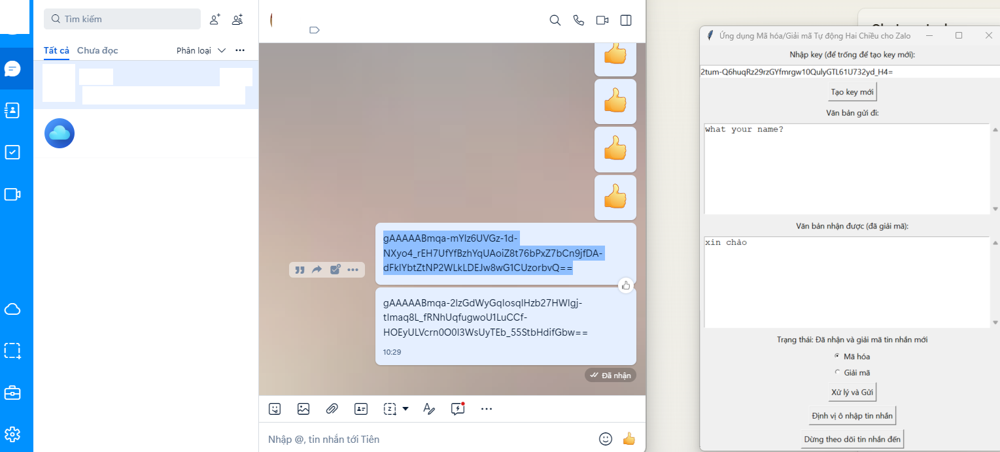

# Ứng Dụng Mã Hóa/Giải Mã Tự Động Hai Chiều cho Zalo

## Hướng Dẫn Sử Dụng

1. **Chạy ứng dụng**: Khởi động ứng dụng trên máy tính của bạn.

2. **Nhập Key**:
   - Nhập key đã có sẵn vào ô nhập key hoặc nhấn "Tạo key mới" để tạo một key mới.

3. **Định Vị Ô Nhập Tin Nhắn**:
   - Mở Zalo và điều hướng đến cuộc trò chuyện mà bạn muốn sử dụng.
   - Nhấn "Định vị ô nhập tin nhắn" và di chuyển chuột đến ô nhập tin nhắn trong Zalo. Giữ nguyên chuột trong 2 giây để xác định vị trí.

4. **Bắt Đầu Theo Dõi Tin Nhắn Đến**:
   - Nhấn "Bắt đầu theo dõi tin nhắn đến" để kích hoạt chức năng tự động giải mã tin nhắn.

5. **Gửi Tin Nhắn Mã Hóa**:
   - Nhập nội dung tin nhắn vào khu vực "Văn bản gửi đi".
   - Chọn chế độ mã hóa hoặc giải mã.
   - Nhấn "Xử lý và Gửi" để mã hóa tin nhắn và gửi tự động.

6. **Nhận Tin Nhắn Mã Hóa**:
   - Khi nhận được tin nhắn mã hóa trong Zalo, sao chép tin nhắn đó.
   - Ứng dụng sẽ tự động bắt nội dung từ clipboard, giải mã và hiển thị trong khu vực "Văn bản nhận được".

## Lưu Ý

- Đảm bảo rằng cả người gửi và người nhận đều sử dụng cùng một key để mã hóa/giải mã.
- Chức năng tự động theo dõi tin nhắn dựa trên clipboard, vì vậy bạn cần sao chép tin nhắn mã hóa từ Zalo để ứng dụng có thể nhận diện và giải mã.
- Cẩn thận khi sử dụng tính năng theo dõi clipboard, vì nó có thể ảnh hưởng đến quyền riêng tư của bạn nếu bạn sao chép các thông tin nhạy cảm khác.

## Giới Thiệu

Ứng dụng này cung cấp một quy trình mã hóa và giải mã tin nhắn hai chiều hoàn chỉnh, giúp bạn giao tiếp an toàn hơn qua Zalo. Tuy nhiên, hãy nhớ rằng không có phương pháp bảo mật nào là hoàn hảo, và bạn nên cẩn thận khi xử lý thông tin nhạy cảm.

---
